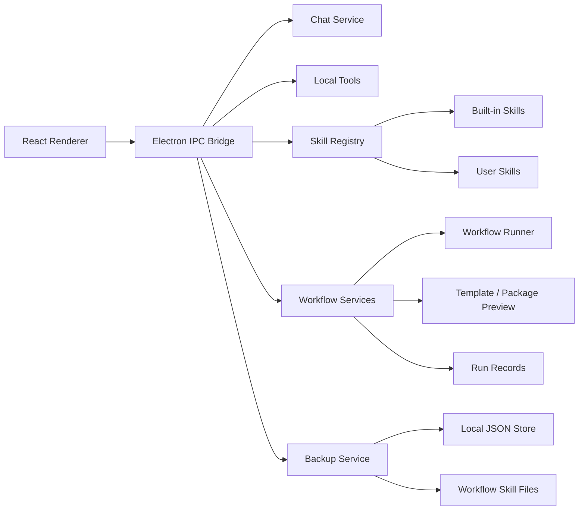

# Architecture

## Data Flow

1. The renderer invokes IPC channels.
2. IPC modules validate payloads and call main-process services.
3. Main-process services read and write local JSON files under Electron `userData`.
4. Workflow execution records step summaries under the workflow data directory.
5. Backup export reads only allowed metadata and writes a `.aionbackup` archive.
6. Backup restore previews first, then merges data into the local store.

## Failure Handling

- IPC handlers return `{ ok: false, error }` instead of throwing into the renderer.
- Workflow failures are persisted as run records.
- Backup preview rejects unsupported schemas, large files, forbidden file names, and traversal paths.
